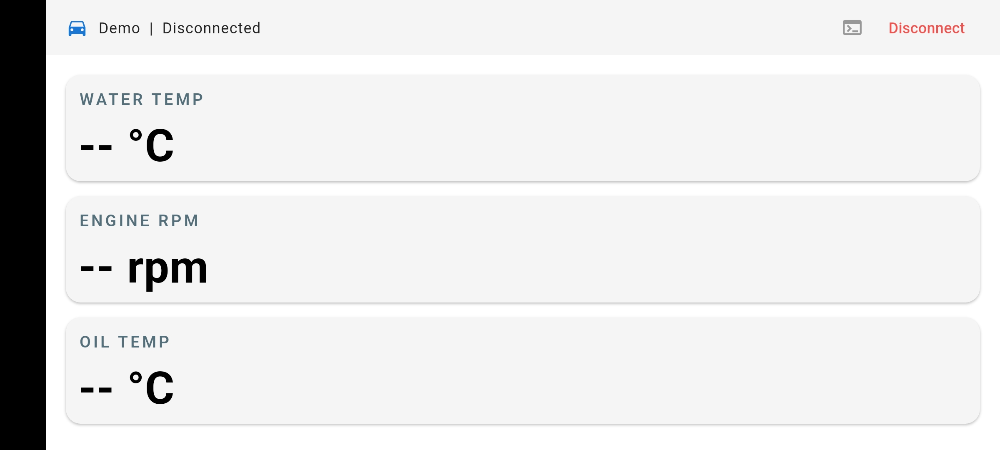
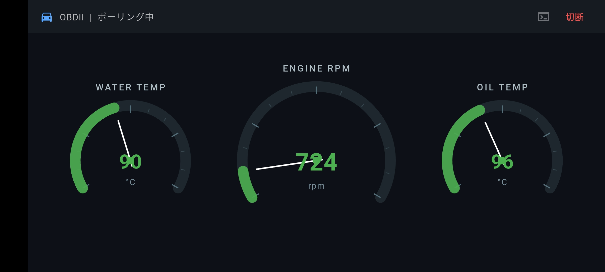
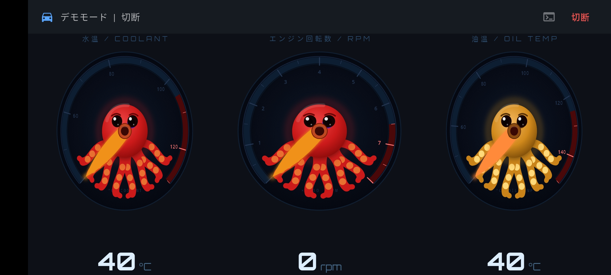
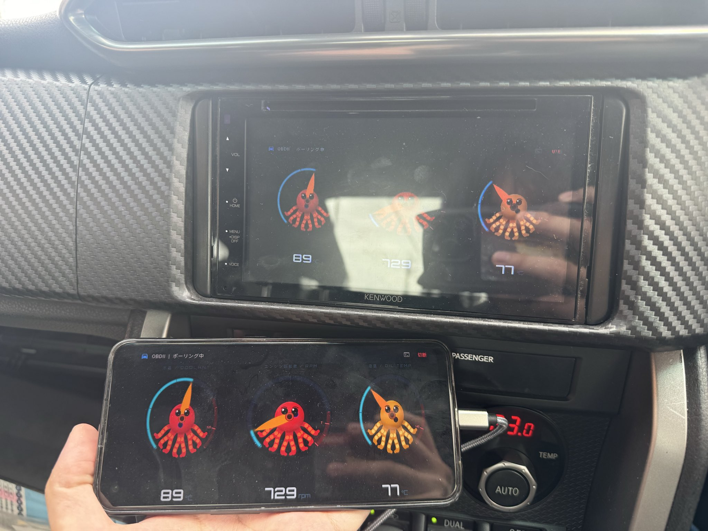

# 86BRZ / FA20 OBD2 Monitor

Real-time OBD2 monitor for Toyota 86 / Subaru BRZ (FA20 engine) via ELM327 BLE adapter.
Toyota 86 / Subaru BRZ（FA20エンジン）向け、ELM327 BLE アダプターを使ったリアルタイム OBD2 モニターアプリ。

---

## Screenshots / スクリーンショット

### Current UI / 現在の画面

### Custom Gauge Examples / カスタムゲージ例

`GaugeWidget` を差し替えることで、自分のデザインのゲージを表示できる。
The gauge widget is replaceable — swap in your own design.

<table>
  <tr>
    <td></td>
    <td></td>
  </tr>
  <tr>
    <td align="center">Arc gauge — dark theme, live OBD2 data 円弧ゲージ（ダークテーマ・実車接続）</td>
    <td align="center">Character gauge — demo mode キャラクターゲージ（デモモード）</td>
  </tr>
  <tr>
    <td colspan="2" align="center"></td>
  </tr>
  <tr>
    <td colspan="2" align="center">Running on a phone and car display / 実車に搭載した様子</td>
  </tr>
</table>

---

## Tech Stack / 技術スタック

| Technology | Role / 用途 |
|---|---|
| Flutter (Dart) | UI framework / UI フレームワーク |
| GetX | State management & navigation / 状態管理・ナビゲーション |
| flutter_blue_plus | BLE communication / BLE 通信 |

---

## Confirmed Environment / 動作確認環境

| Item / 項目 | Details / 内容 |
|---|---|
| Vehicle / 車両 | Toyota 86 / Subaru BRZ (ZC6) — FA20 engine |
| OBD2 Adapter / アダプター | ELM327 BLE（FFF0 / FFE0 サービス搭載品） |
| Platform / プラットフォーム | Android |
